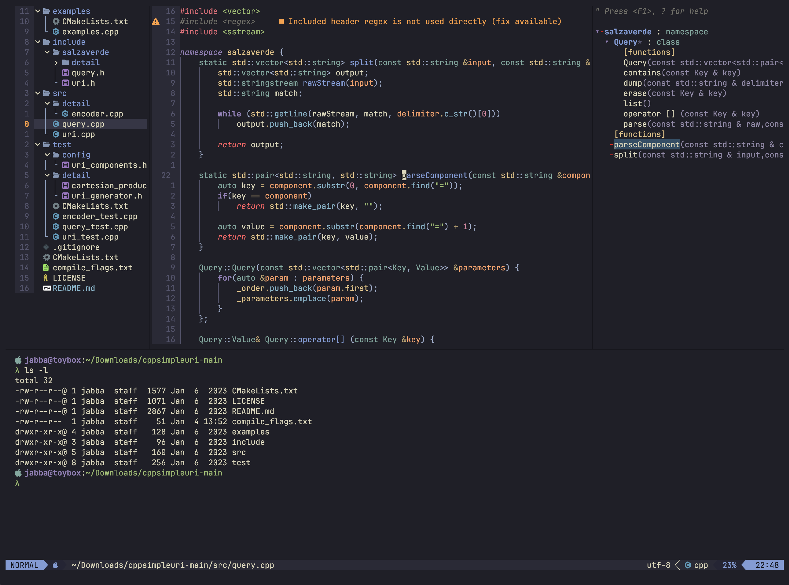

## Jabba's Neovim C/C++ Configuration
#### _Currently used in both MacOS and Windows_

This is my personal Neovim configuration for C/C++. While it works well for me and my workflow, it may not be what you expect or prefer. Please use this configuration with that in mind.

### Preview

### Language Features

* LSPs: clangd, cmake-language-server and lua-language-server
    * Includes clang-tidy support with clangd
* LSP Completion: hrsh7th/nvim-cmp
* Language Formatting and Diagnostics: nvimtools/none-ls.nvim
    * Formatters include: clang-format, cmake-format and stylua

_Please Note: clangd requires the presence of either a compile_commands.json file or a compile_flags.txt file in your project. For more information, please refer to the following link: [clangd Getting Started](https://clangd.llvm.org/installation.html#project-setup)_

### Other Features

* Theme: kanagawa [rebelot/kanagawa.nvim](https://github.com/rebelot/kanagawa.nvim.git)
